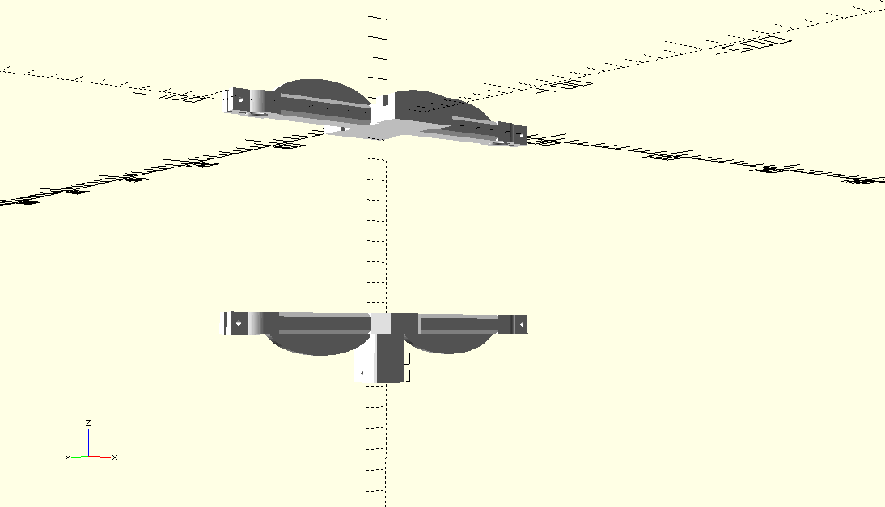

# Open Point-dendrometer
A point dendrometer for small trunks and branches of tropical trees

## Objectives
Build a high precision point dendrometer to daily variations in water status and seasonnal growth of trees. 
There are already designs for point dendrometers on the market. Unfortunately most of them are based on a screw design and their linearity is sub-par. We choose to overcome these issues by inspiring ourselves on previous designs that use rods instead ([PepiPiaf](https://piaf.clermont.hub.inrae.fr/methodes-et-modeles/pepipiaf)) and by selecting high qualtity LVDT sensors.

## Hardware
### Mechanics

The build is based on a 3D printed holder and carbon-fiber rods. The 3D printed holder gives us the ease of fabrication, ease of prototyping and low-cost that makes it possible to build a large number of said dendrometers for a reasonnable price. The carbon-fiber rods give us a good temperature response of the dendrometer due to their low expansion coefficient.

The 3D printable designs are respectively the [tree attachement](/Tree%20attach.stl) and the [LVDT holder](LVDT_holder_part.stl). 

### Electronics
#### Linear potentiometer
The linear potentiometer that we use has 0.5% linearity and includes the spring (assuring contact) inside its body. It comes in a practical package around which the 3D printed holder is designed. The reference is BT404 and it can be found [here](https://www.mouser.fr/ProductDetail/858-404R10KL.5).
#### ADC
To read the output of the linear potentiometer we use the ADS1115 ADC. It has 16 bit precision that allows us to have a resolution of around 0.2µm (12.7mm of travel divided by 16 bits). This is of course overkill but a resolution of 1µm is useful when follwoing daily varaitions of stem diameter.
#### Micro-controller
To read the ADC outputs we use a Pi-Pico running micropython. This is meant to be interfaceable with our own brand of ModBus network that we developped for instrumented sites (see [here](https://github.com/ivancornut/ecophys-modbus)).

## Calibration
For calibration we use an aluminium rod with a known thermal expansion coefficient in a heating oven. By heating the whole setup we are able to calculate the deviation of the sensor due to thermal effects and calculate a linear correction to apply in the field. The code 
